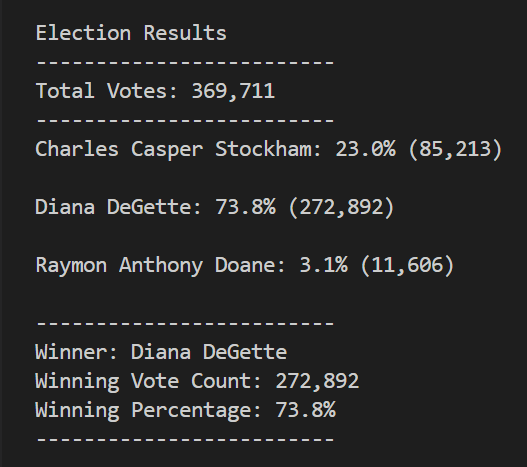

# Election_Analysis

## Overview

The Colorado Board of Education gave me the ask of:
- Calculate the total number of votes cast.
- Get a complete list of candidates who received votes.
- Calculate the total number of votes each candidate received.
- Calculate the percentage of votes each candidate won.
- Determine the winner of the election based on popular vote.

## Resources
- elecion_results.csv
- Python and VS Code

## Summary

### The election results indicate:

To Summarize the image above:
- Diana DeGette received 73.8% votes
- Raymond Doane received 3.1% of the votes
- Charles Stockholm received 23.0% of the votes

These numbers indicate that Diana was the winner of the election

## Challenge Overview

The intent of the challenge was to successfully answer the following questions:

- How many votes were cast in this congressional election?
- Provide a breakdown of the number of votes and the percentage of total votes for each county in the precinct.
- Which county had the largest number of votes?
- Provide a breakdown of the number of votes and the percentage of the total votes each candidate received.
- Which candidate won the election, what was their vote count, and what was their percentage of the total votes?

### The county results indicate

